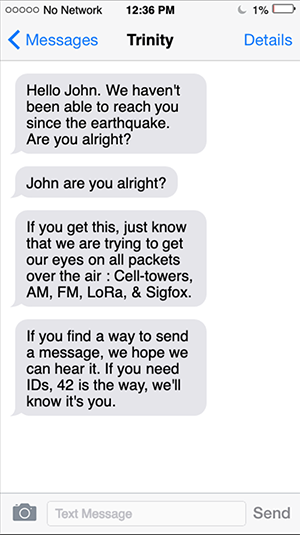

# Save-LoRa - Game Guide

Let's make it quick.

You were chilling in your geek cave, and something happened outside.  
Earthquake, Zombie apocalypse, Nuclear attack? You don't know, and who cares?? Focus!  
    
You are trapped in your basement, the door is jammed, the internet is down, your phone doesn't get any signal and no one knows you're here.  
So really, what happened is the least of your worries right now.  

The only thing you need to do is make sure people know you're trapped in...  

Three days go on, and you manage to receive a couple texts from your friend just before your phone goes off.  
Here is what it says:

Bingo! You remember buying a Small LoRa sensor years ago, and your laptop still has some battery.

Can you make your way through the LoRaWAN protocol, connect to a network, and emit your location?

Well, let's hope the answer is yes, because your survival depends on it.

## Before your Start

 1. Register your team and your device on [https://www.save-lora.takima.io](https://www.save-lora.takima.io)
 2. Change your configuration in **chapter1/src/conf.js** and **chapter2/src/conf.js** with the elements provided on team creation

**Hack Gotham City's LoRa Network**

[Chapter one steps are available here](ch1-rescue-hacker.md)

**Get around LoRa & send location**

[Chapter two steps are available here](ch2-geek-victim.md)
